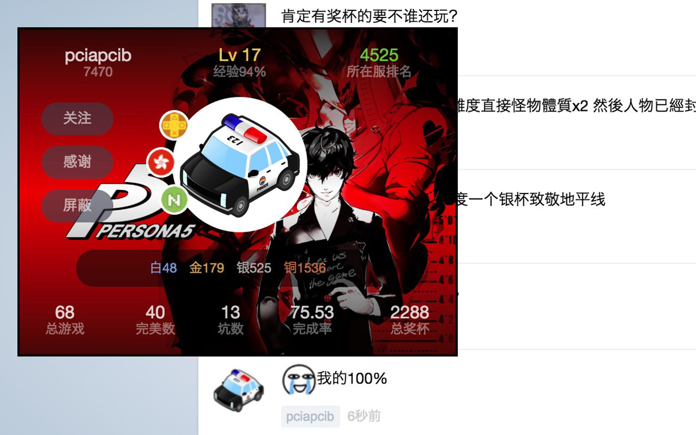
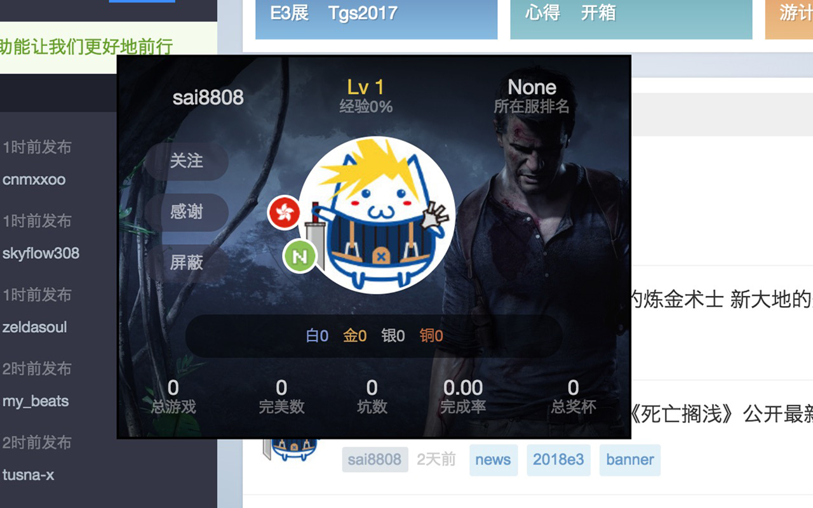
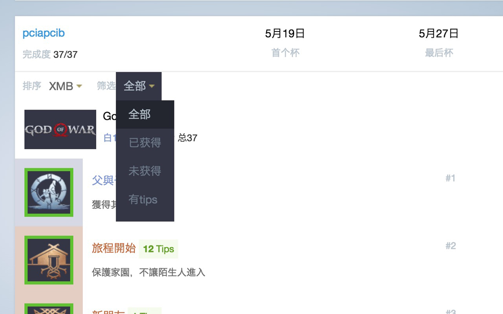
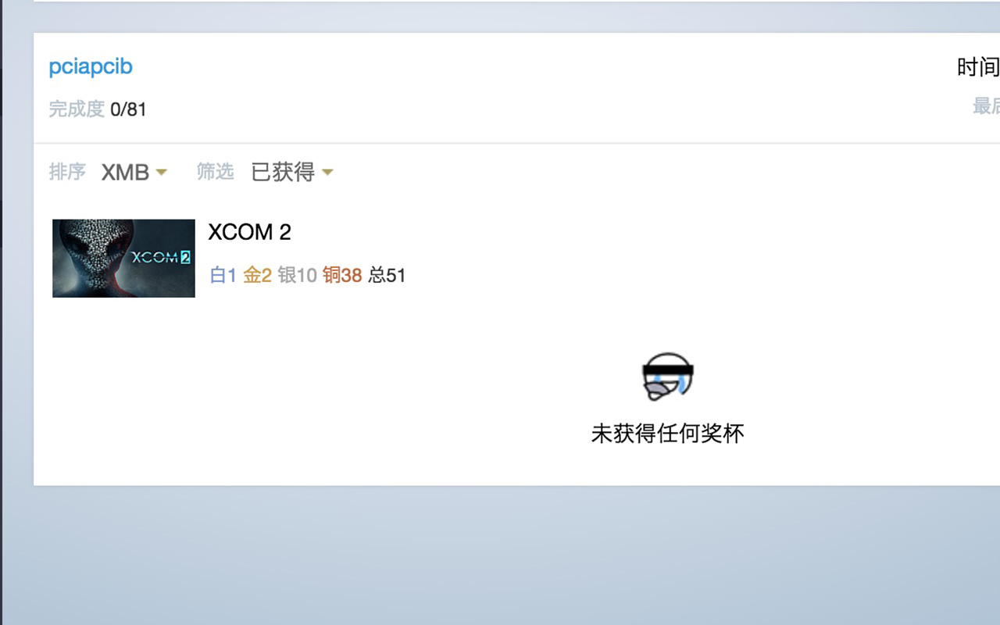

# Psnine Plus

> Tiny extension for Psnine

Psnine 浏览器扩展，增强 Psnine 的浏览体验。

## 功能

- PSN 卡片

鼠标移动至 PSN 用户页面的链接(如新闻、奖杯心得、机因中的用户名和头像)时，会出现该用户的悬浮 PSN 卡片，大佬信息一览无余，方便快速识别、膜拜大佬。

 


- 奖杯筛选

在游戏页面可筛选奖杯，其中从个人主页进入的游戏页面，可根据「已获得」、「未获得」、「有tips」进行筛选；其它情况只可根据「有tips」进行筛选。

 



## 安装

从各浏览器的应用商店或应用中心安装本扩展：

- [Chrome Extension](https://chrome.google.com/webstore/detail/psnine-plus/lpalganafhechhdedehdbaenciakmgka)

- [Firefox Addon](https://addons.mozilla.org/zh-CN/firefox/addon/psnine-plus)

然后进入 [Psnine](https://psnine.com) 查看效果。

### 手动安装

#### 下载 crx 文件

从 [Releases](https://github.com/pciapcib/psnine-plus/releases) 下载最新版本。

#### 手动打包

``` bash
# 克隆本仓库
$ git clone https://github.com/pciapcib/psnine-plus.git

# 安装依赖
$ npm install

# 进行打包，打包后的文件位于 dist 目录
$ npm run build
```

将下载或手动打包后的 crx 文件拖入浏览器的扩展管理界面，目前已支持的浏览器的有：

- Chrome 
- Firefox
- Opera
- QQ 浏览

其它浏览器可自行测试，理论上使用 Chromium 内核的浏览器均支持

## 贡献

如果发现了 Bug 或其它问题，以及需要增加新功能时，请在本仓库新建 `issue`，提交 pr 前请务必进行代码风格检查。

非开发者也可联系邮箱 `pciapcib@163.com`。

## License

[MIT](https://opensource.org/licenses/MIT)
